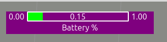
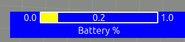

# Min/Max/Current Value RViz Overlay

This package provides an RViz display plugin that visualizes a numerical value relative to its minimum and maximum bounds, often presented as a horizontal or vertical bar. It includes features to indicate critical states through color changes or flashing animations.

## Installation

1.  **Clone the Repository:**
    Clone this repository into the `src` folder of your ROS 2 workspace (e.g., `~/min_max_curr_rviz_overlay_ws/src`).

    ```bash
    # cd ~/your_ros2_ws/src
    # git clone git@github.com:wimblerobotics/min_max_curr_rviz_overlay.git
    ```

2.  **Build the Package:**
    Navigate to the root of your workspace and build the package using `colcon`.

    ```bash
    cd ~/min_max_curr_rviz_overlay_ws
    colcon build --symlink-install --packages-select wifi_viz
    ```

3.  **Source the Overlay:**
    **Crucially**, before running RViz, you need to source the setup file of your workspace in the *same terminal* where you will launch RViz. This allows RViz to find the newly built plugin.

    ```bash
    cd ~/min_max_curr_rviz_overlay_ws
    source install/setup.bash
    ```
    *Note: You need to do this sourcing step in every new terminal you open before running `rviz2` if you want to use this overlay.*

## Usage

1.  **Launch RViz:**
    Make sure you have sourced your workspace as described above.

    ```bash
    rviz2
    ```

2.  **Add the Display:**
    *   In RViz, click the "Add" button in the "Displays" panel.
    *   Find the "MinMaxCurrDisplay" plugin under the "wifi_viz" category.
    *   Click "OK".

3.  **Configure the Display:**
    *   Select the "MinMaxCurrDisplay" in the Displays panel.
    *   Set the "Topic" property to the ROS 2 topic where `wifi_viz/msg/MinMaxCurr` messages will be published (e.g., `/battery_percentage_overlay`).
    *   Adjust other properties like width, height, position, colors, font size, and orientation as needed.

4.  **Publish Data:**
    Publish messages of type `wifi_viz/msg/MinMaxCurr` to the topic you configured.

## Examples

Here are some examples using `ros2 topic pub` to send a single message to the `/battery_percentage_overlay` topic. These assume the display in RViz is configured to listen to this topic.

**Example 1: Critical (Under Threshold), No Animation, Red Current Color**

Value (0.15) is below critical (0.25), but animation is NONE. The bar color will be red.

~

```bash
ros2 topic pub --once /battery_percentage_overlay wifi_viz/msg/MinMaxCurr '{
  min: 0.0,
  max: 1.0,
  current: 0.15,
  critical_value: 0.25,
  critical_if_under: true,
  critical_animation_type: 0, # ANIMATION_NONE
  critical_python_function: "",
  title: "Battery %",
  compact: false,
  current_color: {r: 1.0, g: 0.0, b: 0.0, a: 1.0}, # Red
  critical_color: {r: 0.5, g: 0.0, b: 0.5, a: 1.0}  # Purple (Not used for background due to ANIMATION_NONE)
}'
```

**Example 2: Critical (Under Threshold), Colorize Animation, Purple Critical Color, Green Current Color**

Value (0.15) is below critical (0.25). Animation is COLORIZE, so the background will turn purple. The bar itself will be green.

~

```bash
ros2 topic pub --once /battery_percentage_overlay wifi_viz/msg/MinMaxCurr '{
  min: 0.0,
  max: 1.0,
  current: 0.15,
  critical_value: 0.25,
  critical_if_under: true,
  critical_animation_type: 1, # ANIMATION_COLORIZE
  critical_python_function: "",
  title: "Battery %",
  compact: false,
  current_color: {r: 0.0, g: 1.0, b: 0.0, a: 1.0}, # Green
  critical_color: {r: 0.5, g: 0.0, b: 0.5, a: 1.0}  # Purple
}'
```

**Example 3: Critical (Under Threshold), Flash Animation, Blue Critical Color, Yellow Current Color**

Value (0.15) is below critical (0.25). Animation is FLASH, so the background will flash using the blue critical color. The bar itself will be yellow.

~

```bash
ros2 topic pub --once /battery_percentage_overlay wifi_viz/msg/MinMaxCurr '{
  min: 0.0,
  max: 1.0,
  current: 0.15,
  critical_value: 0.25,
  critical_if_under: true,
  critical_animation_type: 2, # ANIMATION_FLASH
  critical_python_function: "",
  title: "Battery %",
  compact: false,
  current_color: {r: 1.0, g: 1.0, b: 0.0, a: 1.0}, # Yellow
  critical_color: {r: 0.0, g: 0.0, b: 1.0, a: 1.0}  # Blue
}'
```

## Message Fields (`wifi_viz/msg/MinMaxCurr`)

*   `min` (float32): The minimum possible value for the range.
*   `max` (float32): The maximum possible value for the range.
*   `current` (float32): The current value to display.
*   `critical_value` (float32): The threshold for the critical state.
*   `critical_if_under` (bool): If true, the state is critical when `current < critical_value`. If false, critical when `current > critical_value`.
*   `critical_animation_type` (uint8): Type of animation for critical state (0: None, 1: Colorize Background, 2: Flash Background).
*   `critical_python_function` (string): (Not currently used by this C++ display) Path to a Python function for custom critical logic.
*   `title` (string): Optional title displayed below/beside the bar. If empty, the topic name is used.
*   `compact` (bool): (Not currently implemented in this version) Intended for a more compact display.
*   `current_color` (std_msgs/ColorRGBA): Color used to draw the fill of the bar representing the current value. Alpha > 0 is required to override the default green/yellow/red gradient.
*   `critical_color` (std_msgs/ColorRGBA): Color used for the background during COLORIZE or FLASH animations when in a critical state.